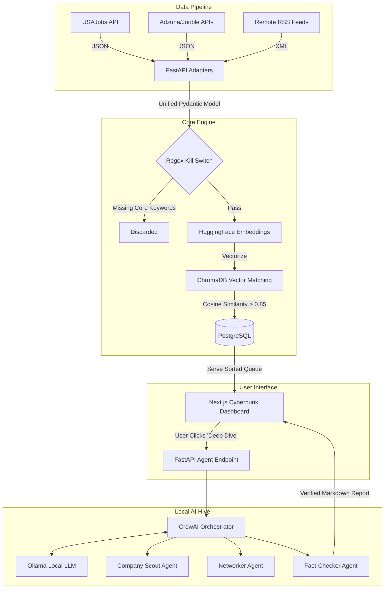

# Product Requirements Document (PRD): Project SYNAPSE

**Systematic Yield Network for AI Placement & Strategic Employment**

## 1. Project Overview

Project SYNAPSE is a Human-in-the-Loop (HITL) AI micro-SaaS designed to automate the sourcing, filtering, and deep-research intelligence gathering for high-level technical roles. The system operates autonomously to ingest job market data, apply deterministic and vector-based matching, and present the results in a high-contrast, cyberpunk-themed React dashboard.

The core objective is to deliver a curated daily queue of high-probability targets—specifically **Corporate AI Architect** roles focusing on macro-level strategic design, offering 100% remote flexibility or comprehensive relocation assistance for finding a home within the United States.

**Monetization Potential:** Once the internal architecture is stable and successfully matching candidates, this custom job-hunting infrastructure will be packaged as a plug-and-play developer boilerplate, serving as a minimum viable product for licensing or outright IP sale.

---

## 2. Technology Stack

The stack is explicitly designed for **privacy-first, zero-API-cost execution**, utilizing open-weight models running on local hardware to maintain strict enterprise data privacy over the generated resumes and strategy documents.

### Frontend (Presentation Layer)

* **Framework:** Next.js (React)
* **Styling:** Tailwind CSS (Cyberpunk aesthetic: `#0a0a0a` backgrounds, electric cyan `#06b6d4` / neon magenta `#db2777` glowing borders via CSS `box-shadow`, Space Mono typography).
* **Rendering:** `react-markdown` for displaying AI-generated dossiers with embedded hyperlink support.

### Backend (Data & Routing)

* **Framework:** FastAPI (Python) for asynchronous REST endpoints and hardware-efficient routing.
* **Task Queue:** APScheduler or Celery for managing the ingestion polling intervals.

### Database Layer

* **Relational DB:** PostgreSQL (Stores raw job postings, application statuses, and extracted metadata).
* **Vector DB:** ChromaDB (Stores dense vector embeddings of job descriptions and the primary candidate profile).

### AI & Agent Orchestration (Local Intelligence)

* **Framework:** CrewAI (Manages the Job Scout, Deep Researcher, and Fact-Checker agents).
* **LLM Server:** Ollama (Serves models locally via REST API).
* **Language Models:** Meta Llama 3 (8B) or Mistral (7B) for agent reasoning, markdown generation, and data extraction.
* **Embedding Model:** HuggingFace `all-MiniLM-L6-v2` for generating the cosine similarity "Alignment Score."

---

## 3. Data Ingestion & The Adapter Pattern

The system relies on asynchronous cron jobs to continuously pipe external data into the local databases. To prevent database bloat and schema fragility, the backend utilizes an **Adapter Pattern**.

Incoming payloads from varied sources are caught by specialized FastAPI adapters, parsed, and mapped into a single, unified `Job` Pydantic model before touching the database.

* **USAJobs API:** High-priority source for federal and defense-contractor architecture roles. The adapter specifically extracts clearance requirements (e.g., from `JobData[0].UserArea.Details.JobSummary`) and concrete application deadlines.
* **Adzuna / Jooble APIs:** Global aggregators utilized with strict parameter filtering.
* **Greenhouse/Lever JSON APIs:** Targeted endpoints for scraping specific, pre-approved company career pages.
* **WeWorkRemotely / RemoteOK RSS:** Unstructured XML feeds targeting distributed teams. The adapter isolates the `<description>` blocks for embedding.

---

## 4. PostgreSQL Database Schema

The schema balances rigid requirements for the matching engine with a `JSONB` safety net to capture source-specific overflow data without breaking normalization.

```sql
CREATE TYPE job_status AS ENUM ('active', 'expired', 'applied', 'interviewing', 'rejected');

CREATE TABLE jobs (
    -- Core Identity
    id UUID PRIMARY KEY DEFAULT gen_random_uuid(),
    source_provider VARCHAR(50) NOT NULL, 
    external_reference_id VARCHAR(255) UNIQUE NOT NULL, 
    
    -- Display Data
    title VARCHAR(255) NOT NULL,
    company VARCHAR(255) NOT NULL,
    department VARCHAR(255), 
    location_string VARCHAR(255),
    is_remote BOOLEAN DEFAULT FALSE,
    
    -- Links & Pay
    job_url TEXT NOT NULL,
    apply_url TEXT, 
    salary_min NUMERIC,
    salary_max NUMERIC,
    salary_interval VARCHAR(50), 
    
    -- Specialized Requirements
    security_clearance VARCHAR(100), 
    
    -- The Payload
    description_markdown TEXT NOT NULL, 
    
    -- Time & Lifecycle
    posted_at TIMESTAMP WITH TIME ZONE,
    closing_date TIMESTAMP WITH TIME ZONE, 
    
    system_status job_status DEFAULT 'active',
    last_verified_at TIMESTAMP WITH TIME ZONE DEFAULT NOW(),
    
    -- The Overflow Safety Net (Schema-on-Read)
    raw_metadata JSONB 
);

CREATE INDEX idx_jobs_status ON jobs(system_status);
CREATE INDEX idx_jobs_closing_date ON jobs(closing_date);
## 5. Data Freshness Strategy (The Stale Job Purge)

To prevent the local AI models from wasting compute on closed roles, the pipeline implements a multi-tiered purging architecture:

* **Deterministic Expiry:** A daily cron job automatically updates `system_status = 'expired'` for any row where the current date exceeds the known `closing_date` (provided by USAJobs).
* **The Async Heartbeat Worker:** Every 12 hours, a FastAPI background worker sends a HEAD/GET request to the URLs of all active jobs. If the endpoint returns a 404, redirects to a generic board, or the page text contains flags like "This position has been filled," the worker flags it as expired.
* **The Data Purge:** A weekly script deletes any job where `system_status = 'expired'` and the `updated_at` timestamp is older than 14 days, keeping the Vector DB and PostgreSQL tables optimized.

## 6. Architectural Schematic



## 7. Data Observation & LLMOps Layer

* **System Health:** Prometheus & Grafana monitor hardware utilization (GPU/CPU RAM usage during local LLM generation), FastAPI endpoint latency, and cron job success rates.
* **AI Observability:** Arize Phoenix (or LangSmith) integrates with the CrewAI pipeline to trace the multi-agent thought process, evaluate ChromaDB retrieval hit rates, and monitor generation speed (tokens/second) to detect hardware bottlenecks.

## 8. Testing Suite

**Backend (Pytest):**
* Validate the Regex Kill Switch against mock payloads.
* Use `pytest-httpx` to mock external API rate limits (429s) and verify FastAPI's fault tolerance.
* Assert ChromaDB cosine similarity scores reflect accurate alignments using extreme dummy data.

**Frontend (Jest & React Testing Library):**
* Verify component rendering for the high-contrast Tailwind classes.
* Test `react-markdown` injection to ensure heavy table and link formatting does not break the UI grid.

**Integration:**
* End-to-End script verifying a dummy PostgreSQL insertion successfully triggers the CrewAI endpoint and returns a formatted report within acceptable local-compute timeframes.
